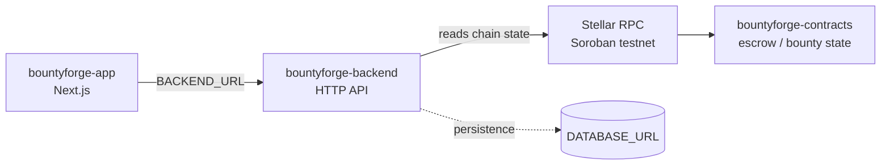

<p align="center">
  
</p>

# BountyForge Backend

> Open bounties with escrow, review, and payout workflows — off-chain indexing/API service.


> **Status note:** v0.1.0 development baseline — **not audited and not production-ready.**

## Why this exists

BountyForge implements open bounties with escrow, review, and payout workflows on Stellar. This repository is the **off-chain indexing/API service** of the three-repo BountyForge system. It stays out of consensus-critical logic; on-chain state is the source of truth.

| Repo | Role |
| --- | --- |
| [bountyforge-contracts](https://github.com/stellar-bountyforge/bountyforge-contracts) | On-chain Soroban escrow and bounty state |
| [bountyforge-app](https://github.com/stellar-bountyforge/bountyforge-app) | User-facing web application |
| **bountyforge-backend** (this repo) | Off-chain indexing/API and operational services |

## Features

- Minimal Node.js HTTP service (no framework dependencies).
- `GET /health` — liveness endpoint returning `{ ok: true, service: "bountyforge-backend" }`.
- `GET /network` — reports the configured Stellar network (testnet).
- Uses `@stellar/stellar-sdk`; persistence hooks via `DATABASE_URL` for future growth.
- TypeScript with `tsc` build and `node --test` tests (`src/server.test.ts`).

## Architecture



## Tech stack

| Layer | Technology |
| --- | --- |
| Runtime | Node.js (ESM) |
| Language | TypeScript 5.8 (`tsx` for dev, `tsc` for build) |
| Blockchain | Stellar / Soroban, `@stellar/stellar-sdk` 17 |
| Testing | `node --test` |

## Project structure

```text
bountyforge-backend/
├── src/
│   ├── server.ts       # HTTP service (health, network)
│   └── server.test.ts  # Tests
├── assets/             # Banner and logo
└── .github/            # CI workflow, CODEOWNERS
```

## Prerequisites

- Node.js ≥ 20
- npm

## Installation

```bash
npm install
```

## Environment variables

Copy `.env.example` to `.env` and fill in the values:

| Variable | Description |
| --- | --- |
| `PORT` | HTTP port the service listens on (default `8787`). |
| `STELLAR_RPC_URL` | Soroban RPC endpoint, e.g. `https://soroban-testnet.stellar.org`. |
| `DATABASE_URL` | Persistence connection string (empty is fine for the current baseline). |
| `CONTRACT_ID` | Deployed BountyForge contract ID the backend reads from. |

## Running locally

```bash
npm run dev
```

Then check <http://localhost:8787/health>.

## Testing

```bash
npm test
```

## Building

```bash
npm run build   # tsc — outputs compiled JS
```

## Roadmap

- [ ] Implement real bounty/escrow API endpoints consumed by bountyforge-app.
- [ ] Add persistence behind `DATABASE_URL`.
- [ ] Index BountyForge contract events.
- [ ] Independent security review (project is unaudited).

## Contributing

See [CONTRIBUTING.md](CONTRIBUTING.md).

## Security

See [SECURITY.md](SECURITY.md). **This project is unaudited** — do not use in production.

## Code of Conduct

See [CODE_OF_CONDUCT.md](CODE_OF_CONDUCT.md).

## Maintainer

**Hikmaholadele** — [@Hikmaholadele](https://github.com/Hikmaholadele)

## License

[Apache-2.0](LICENSE)
